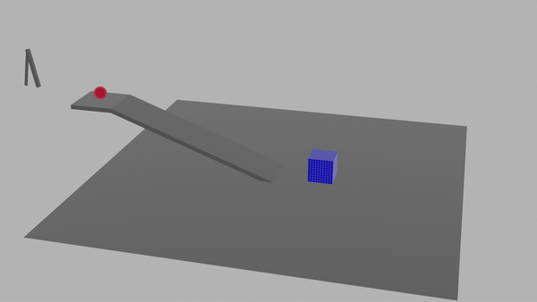
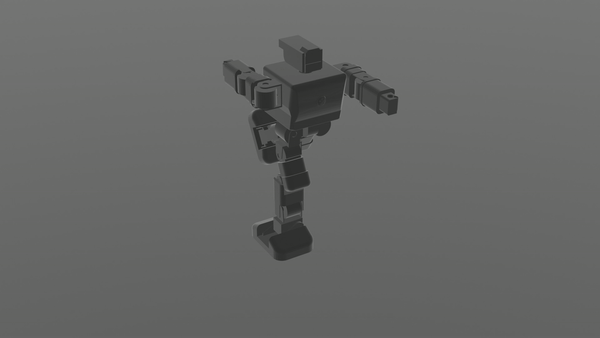
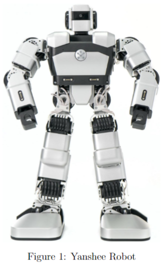
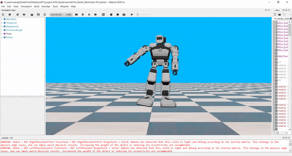

# CMPEN 497 Spring 2021 Humanoid Robots PhysicsVision Simulation

Course Goals and Objectives:
Learn fundamentals of humanoid robot simulation including the following topics:
3D geometry and camera models
3D modeling
Kinematics and dynamics
Stability
Simulation software
Computer vision
Robot Planning

## Project1
- RobotDuring  Summer  2019,  Dr.   Liu  and  members  ofthe LPAC lab led a robotics cap for middle school stu-dents:Dancing with Robots.  During this camp,students  used  UBTECH  Yanshee  robots.   They  areprogrammable,  open-source  robots  that  have  17  de-grees of freedom and an on-board Raspberry Pi com-puter.Due to the remote nature of this course, you willnot be able to work on the physical robots.  We will beproviding videos of the robot dancing so you can getan idea of how the robot moves.  It has three degreesof freedom in each of its arms,  five in each leg,  andone where its head meets its torso.The goal of this project is to create a 3D model ofthis robot and test its stability when it is in a varietyof different poses and environments.  One purpose ofthis project is to give you experience using a 3D mod-eling and physics simulation tool while giving you anunderstanding of what’s going on behind the scenesof some other simulation tools.
- Link to Dancing with Robots:https://sites.psu.edu/dancingwithrobots/

## Project2

- Unlike Project 1, we do not provide video tutorials for Webots.  We do, however, providelinks to the official Webots documentation and the official Webots tutorials which are a partof the User Guide.  You are encouraged to look at the samples provided with Webots andgain hands on experience that way.  There are also other video tutorials online that you canreference if you prefer.

- The first thing you will do in this project is reformat data taken directly from the robotin a way that it becomes usable by Webots.  You will then modify the simulated robot androbot controller such that it outputs center of mass (CoM) and raw pressure data for eachof the three dances.  Next, you will take the raw pressure data and write code to find thecenter of pressure (CoP) at each time step.  Lastly, you will use the CoM and CoP data thatyou generated to compute the robot’s stability using two different metrics.
- 
- Webots User Guide:https://cyberbotics.com/doc/guide/indexWebots 
- Reference Manual:https://cyberbotics.com/doc/reference/index

## Project3

- In Project 2, you gained experience working with a simulated Yanshee in Webots.  Now,you will be using this knowledge and begin controlling the robot using a computer visionprogram you write outside of Webots.  You will best learn how to do this project throughtrial and error and reading documentation.The goal of this project is for you to get hands-on experience with computer vision whilereinforcing your knowledge of running simulations in Webots.  Through this project you willbecome familiar with both manipulating images and using a popular computer vision library.

## Project4
- n this project, you will put your knowledge about humanoid robots and stability to use.You will be creating an original dance that meets a certain set of specifications (listed laterin the document) and running stability analysis on it.  In addition, you will have to presentyour approach to this project in class.  We will also be seeing if your dance behaves properlyon the physical robot.

## [lab2](lab2)
### Geometric Transformations in Blender

## [lab3](lab3)
### Physics Constraints in Blender

## [lab4](lab4)
### Introduction to Kinematic Chains

## [lab5](lab5)
### More Kinematic Chains

## [lab6](lab6)
### Intro to Webots

## [lab7](lab7)
### Computing Center of Mass

## [lab9](lab9)
### Vision 1 - Motion Detection

## [lab10](lab11)
### Vision 2 - Face Detection

## [lab11](lab11)
### Vision 3 - Triangulation

## [lab13](lab13)
### Reinforcement Learning - Setup

## [lab14](lab14)
### Reinforcement Learning

