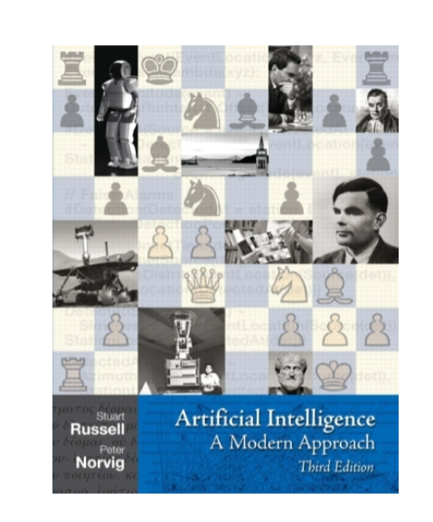

# CMPSC 442: Artificial Intelligence

Students who do the work will learn
- Basic techniques for building intelligent computer systems
  - Search, (games,) constraint satisfaction, uncertainty and probability, Bayes Rule, Naïve Bayes, Hidden Markov Models
  - Introduction to fundamental concepts in machine learning: linear regression, linear regression classifier, perceptron learning rule
- In depth consideration of the role AI will play in our lives in the next decades

## [HW1](hw1.py)
- Python Concepts
- Working with Lists 
- Sequence Slicing
- Combinatorial Algorithms 
- Text Processing
- Polynomials

## [HW2](hw2.py)
- N-Queens
- Lights Out 
- Linear Disk Movement

## [HW3](hw3.py)
- Tile Puzzle
- Grid Navigation
- Linear Disk Movement, Revisited
- Dominoes Game

## [HW4](hw4.py)
### *Spam Filter*
In this section, you will implement a minimal system for spam filtering. You should unzip thehomework4_data.zip file in the same location as your skeleton file; this will create ahomework4_data/train folder and a homework4_data/dev folder. You will begin by processing theraw training data. Next, you will proceed by estimating the conditional probability distributions ofthe words in the vocabulary determined by each document class. Lastly, you will use a **naive Bayesmodel** to make predictions on the publicly available test set, located in homework4_data/dev.

## [HW5](hw5.py)
### *Markov Models*
In this section, you will build a simple language model that can be used to generate random text resembling asource document. Your use of external code should be limited to built-in Python modules, which excludes, for example, NumPy and NLTK.

## [HW6](hw6.py)
### *Hidden Markov Models*
In this section, you will develop a hidden Markov model for part-of-speech (POS) tagging, using theBrown corpus as training data. The tag set used in this assignment will be the universal POS tag set,which is composed of the twelve POS tags NOUN (noun), VERB (verb), ADJ (adjective), ADV (adverb),PRON (pronoun), DET (determiner or article), ADP (preposition or postposition), NUM (numeral),CONJ (conjunction), PRT (particle), '.' (punctuation mark), and X (other).As in previous assignments, your use of external code should be limited to built-in Python modules,which excludes packages such as NumPy and NLTK.

## [HW7](hw7.py)
### Sudoku
In the game of Sudoku, you are given a partially-filled 9 x 9 grid, grouped into a 3 x 3 grid of 3 x 3blocks. The objective is to fill each square with a digit from 1 to 9, subject to the requirement thateach row, column, and block must contain each digit exactly once.In this section, you will implement the **AC-3 constraint satisfaction** algorithm for Sudoku, alongwith two extensions that will combine to form a complete and efficient solver.

