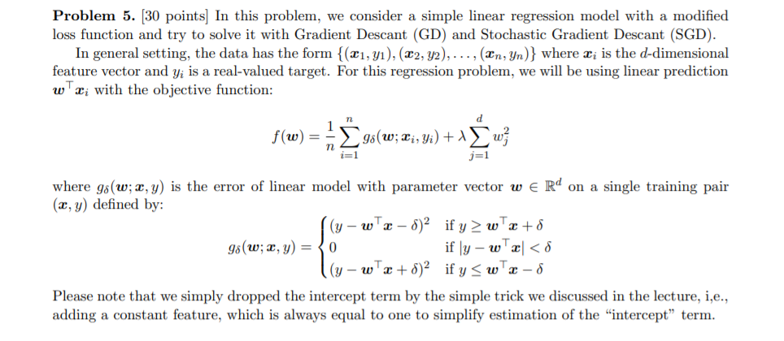

# CMPSC 448: Machine Learning and Algorithmic AI

The goal of this course is to introduce data analysis from the machine learning perspective, inparticular how to design and evaluate data-driven solutions for real problems in differentdomains. Students will gain familiarity with the workings of common machine learning modelsand will learn how noise and bias in the data affect their results. The course assumesprogramming skills in Python and knowledge in linear algebra, calculus, basic probability andstatistics.

## Topics and Schedule (Tentative)
We will cover the following topics in four parts.
- PART 1: The Basics of Machine Learning and Background
  - Introduction to Machine Learning
  - The Process of Learning and Key Concepts
  - Background I: Linear Algebra and Vector Calculus
  - Background II: Convex Analysis and Optimization
  - Exploratory Data Analysis
  
- PART 2: Supervised Learning
  - Regression: Ordinary Least Squares, Ridge Regression, Principal Component Regression(PCR), and Lasso
  - Nearest Neighbors
  - Artificial Neural Networks (Perceptron & Deep Neural Networks)
  - Logistic Regression
  - Decision Trees
  - Support Vector Machines
  - Ensemble methods: Bagging and Boosting
  
- PART 3: Unsupervised Learning
  - Clustering: k-means, k-means++, and Mixture of Gaussians
  - Principal Component Analysis (PCA)
  - Matrix Factorization
  
- PART 4: Reinforcement Learning
  - Bandits
  - Markov Decision Processes
  - Dynamic Programming
  - Temporal Difference (SARSA and Q-learning)
  
## [hw1](Homework%201)
### Exploratory Data Analysis with pandas Problem
#### Problem5
- As it has been emphasized in the lectures, we need to have a good understandingof data before training a machine learning model.  In this assignment, you are asked to analyze the UCIAdult data set.  The Adult data set is a standard machine learning data set that contains demographicinformation  about  the  US  residents.   This  data  was  extracted  from  the  census  bureau  database. Thedata set contains 32561 instances and 15 features (please check the notebook for possible values of eachfeature) with different types (categorical and continuous).

## [hw2](Homework%202)
### k-NN algorithm
#### Problem 4
In this problem you will use the Pima Indians Diabetes dataset from the UCI repository to experiment with the k-NN algorithm and find the optimal value for the number of neighbors k. You do not need to implement the algorithm and encouraged to use the implementation in scikit-learn.Below is a simple code showing the steps to use the NN implementation when the number of neighbors is 3.
### Gradient Descant (GD) and Stochastic Gradient Descant (SGD).
#### Problem 5

## [hw4](Homework%204)
### Boosted Decision Trees & Random Forests & Support Vector Machines with Gaussian Kernel
#### Problem 2
- All of these are available in scikit-learn, although you may also use other external libraries (e.g., XGBoost 1for boosted decision trees and LibSVM for SVMs). You are welcome to implement learning algorithms for these classifiers yourself, but this is neither required nor recommended.

- Use the non-linear classifiers from above for classification of Adult dataset. You can download the data from a9a in libSVM data repository. The a9a data set comes with two files: the training data file a9a with 32,561 samples each with 123 features, and a9a.t with 16,281 test samples. Note that a9a data is in LibSVM format. In this format, each line takes the form 〈label〉 〈feature-id〉:〈feature-value〉 〈featureid〉:〈feature-value〉 ..... This format is especially suitable for sparse datasets. Note that scikit-learn includes
utility functions (e.g., load svmlight file) for loading datasets in the LibSVM format.

- For each of learning algorithms, you will need to set various hyperparameters (e.g., the type of kernel
and regularization parameter for SVM; tree method, max depth, number of weak classifiers, etc for XGBoost; number of estimators and min impurity decrease for Random Forests). Often there are defaults that make a good starting point, but you may need to adjust at least some of them to get good performance. Use hold-out validation or K-fold cross-validation to do this (scikit-learn has nice features to accomplish this, e.g., you may use train test split to split data into train and test data and sklearn.model selection for K-fold cross validation). Do not make any hyperparameter choices (or any other similar choices) based on the test set! You should only compute the test error rates after you have settled on hyperparameter settings and trained your three final classifiers.

### Clustering
#### Problem 3
For this problem, you will implement the k-means++ algorithm in Python. You will then use it to cluster Iris dataset from the UCI Machine Learning Repository. The data is contained in the iris.data file, while the iris.names file contains a description of the data. The features x are given as the first four comma-separated values in each row in the data file. The labels y are the last entry in each row, but you do NOT need the class label for clustering.

## [hw5](Homework%205)
### PCA
#### Problem 1
As we discussed in the lecture, the PCA algorithm is sensitive to scaling and pre-processing of data. In this problem, we explore few data pre-processing operations on data
matrices.
#### Problem 2
As we discussed in the lecture, the PCA algorithm is sensitive to scaling and pre-processing of data. In this problem, we explore few data pre-processing operations on data
matrices.
### Reinforcement Learning
#### Problem 4
Consider the MDP represented by a graph in Figure 1 with discount factor γ ∈ [0, 1). States are represented by circles. The pair on the arrows shows the action to be taken
and the transition probability from a state to another state, respectively (please note that the representation of MDP as a graph here is slightly different from Example 3.3 in the book). Each of the parameters p and q are in the interval [0, 1]. The reward is 10 for state s3, 1 for state s2, and 0 otherwise. Note that this means, from s0, after taking an action, it will receive 0 reward no matter what the action is. This is similar for other states.

