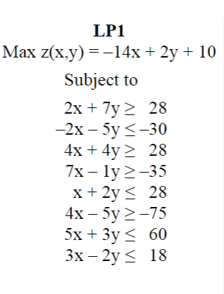
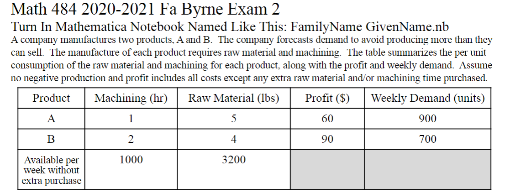
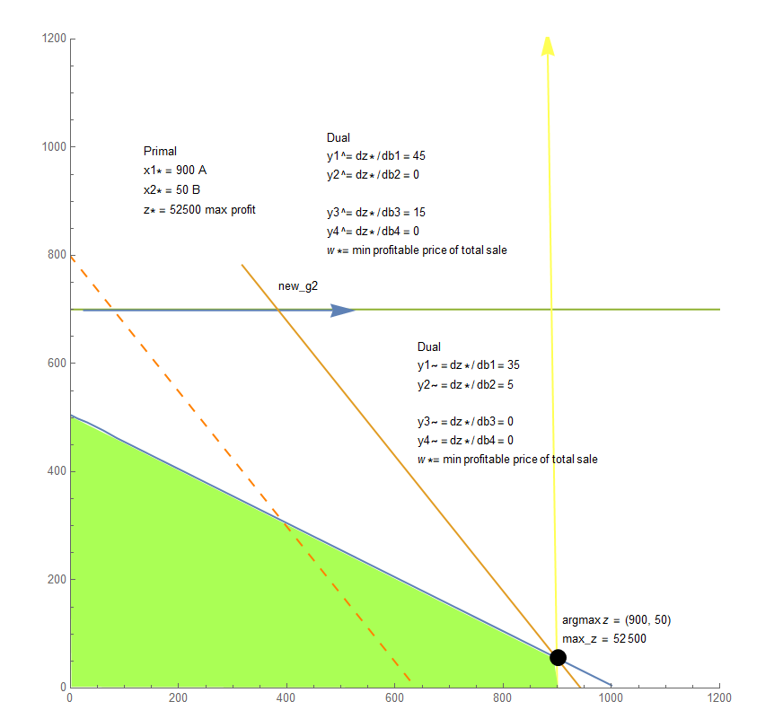

# MATH 484: Linear Programs and Related Problems

The goal of the course is to introduce the concept of Linear Programming, explore existing methods of solving Linear Programming problems and investigate many related optimization problems with application in economics, business, transportation etc.

## [Quiz5](Quiz%205) 
- Geometry of Pivoting

## [Quiz7](Quiz%207)
- Graphical Dual Method 

## [Quiz8](Quiz%208)
- Duality and Rates of Change

## [EXAM1](EXAM%201)
- Graphical Dual Method 
  -  | 

## [EXAM2](EXAM%202)

