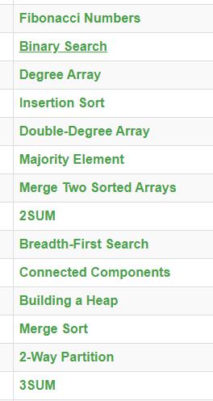
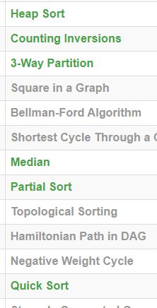

# Spring 2020, CMPSC 465 Data Structures and Algorithms

## Class Goals and Objectives.
This class introduces undergraduate students to the principles of efficient algorithm design, and teaches them how to analyze the asymptotic behavior of both recursive and non-recursive algorithms. The first objective is to teach a precise notion of efficiency: time and space complexity. The second is to provide mathematical tools to compare efficiency of various algorithms or programs. These tools contain the basic methods for finding the rates of growth of functions, which include solving recurrence relations. A part of this objective is to convey the dramatic importance of the selection of an appropriate algorithmic method for a given task. The third goal is to provide a variety of tools which are indispensible in the design of efficient algorithms. These tools consist of: (a) building blocks, which include the most important data structures and several classic algorithms, (b) design paradigms, including divide-and-conquer, greedy, and dynamic programming; several classic algorithms are presented as applications of these paradigms. It is assumed that students entering this class know how to analyze algorithms for correctness, but further mastery of this aspect of algorithm design is also an objective of this course.

## Topics
Introduction, asymptotic notation, recurrences, divide-and-conquer, dynamic programming, greedy algorithms, elementary data structures, heaps, hash tables, binary search trees, sorting algorithms, graph algorithms, NP-Completeness.

## Extra points
### Rosalind Problems
  
